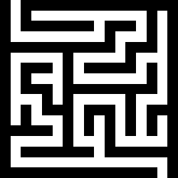

# mazeGenerator

Python module to generate mazes



## Requirements

Needs numpy for array handling and pypng to save mazes to .png files.

Install requirements with 
```
pip install -r requirements.txt
```
## Usage

```python
import mazeGen
maze = mazeGen.generateMaze(15,15)
```

Creates a small 15x15 maze with one entrance and on exit
